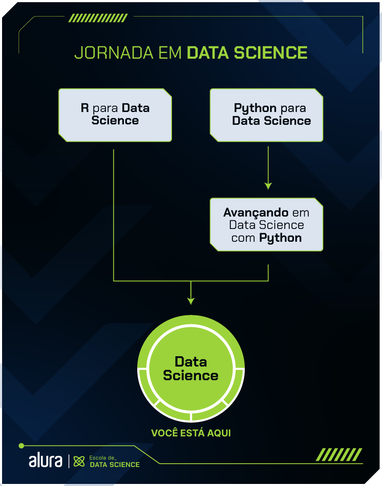

# python-data-science-alura
Este repositório é a concentração de meus materiais e projetos envolvendo a área de Data Science com Python que estou aprendendo na plataforma Alura.

    

        Abaixo está um pouco da trajetória desta formação e seus respectivos cursos:
    

    

